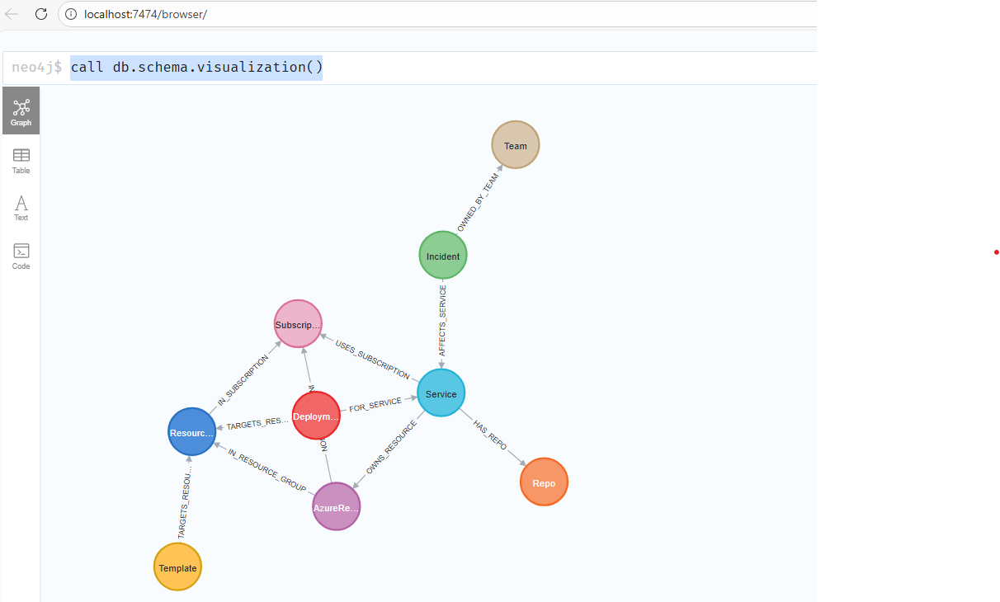

# Approach 2 (existing graph)

Run Neo4j in Docker, ingest the sample CSV dataset, and query it via the Neo4j MCP server.

## Prerequisites

- Docker Desktop (or Docker Engine) with `docker compose`
- `uv`/`uvx` installed (for running the Neo4j MCP server)
- VS Code with MCP servers support enabled

## 1) Configure environment

From the root folder of the repo:

```bash
source .venv/bin/activate
cd approach2-using-existing-graph
cp .env.template .env
```

Edit `.env` and set at least:

```bash
NEO4J_PASSWORD=<please-change-me>

# Neo4j connection info (used by the Neo4j MCP server config in .vscode/mcp.json)
NEO4J_URI=bolt://localhost:7687
NEO4J_USERNAME=neo4j
NEO4J_DATABASE=neo4j

# Local ports exposed on your machine
NEO4J_HTTP_PORT=7474
NEO4J_BOLT_PORT=7687
```

Load the env vars into your shell:

```bash
set -a
source .env
set +a
```

## 2) Start Neo4j + ingest sample data

The helper script starts Neo4j and runs the import against the mounted data files:

```bash
# Import JSON files (default)
./scripts/neo4j_up_and_import.sh

# Or explicitly specify format
./scripts/neo4j_up_and_import.sh json

# Import CSV files (backward compatibility)
./scripts/neo4j_up_and_import.sh csv
```

**Data Format**: The sample data is available in both JSON and CSV formats in `sample-data/`:
- **JSON** (default): Modern format with support for nested structures, used by default
- **CSV** (legacy): Backward compatibility format, flat structure

The import script uses:
- `apoc.load.json` for JSON files (requires APOC plugin)
- `LOAD CSV` for CSV files (built-in Neo4j)

See [`sample-data/README.md`](sample-data/README.md) for detailed format documentation.

**Idempotency**: Re-running the import is safe. The script uses Neo4j constraints with `MERGE` operations, so:
- Nodes with the same unique identifiers won't be duplicated
- Properties may be updated on re-run
- Relationships are recreated safely without duplication

## 3) Schema validation using Neo4j Browser

Open:

- Neo4j Browser: `http://localhost:${NEO4J_HTTP_PORT:-7474}`
- Bolt URL: `neo4j://localhost:${NEO4J_BOLT_PORT:-7687}`

Login:

- Username: `neo4j`
- Password: `$NEO4J_PASSWORD`

As a simple validation, in Neo4j Browser run the following Cypher query to visualize the graph schema:

```
CALL db.schema.visualization()
```



## 4) Minimal validation queries

Validate the import completed successfully:

```bash
./scripts/validate_import.sh
```

This script checks:
- Node counts for all entity types (Service, Incident, AzureResource, etc.)
- Relationship counts between nodes
- Sample service with its connected entities

**Expected node counts from sample data:**
- Services: 12
- Incidents: 12
- Azure Resources: 12
- Deployments: 12
- Templates: 12
- Subscriptions: 7
- Resource Groups: 24
- Repos: 14
- Teams: 12

**Manual validation queries** (run from your shell):

```bash
# Count services
docker exec neo4j-risk cypher-shell -u neo4j -p "$NEO4J_PASSWORD" "MATCH (s:Service) RETURN count(s) AS services;"

# Count incidents
docker exec neo4j-risk cypher-shell -u neo4j -p "$NEO4J_PASSWORD" "MATCH (i:Incident) RETURN count(i) AS incidents;"

# Count resources
docker exec neo4j-risk cypher-shell -u neo4j -p "$NEO4J_PASSWORD" "MATCH (r:AzureResource) RETURN count(r) AS resources;"
```

## 5) Starting Neo4j MCP server (VS Code)

This repo includes a VS Code MCP configuration in `.vscode/mcp.json` for the [`mcp-neo4j-cypher`](https://pypi.org/project/mcp-neo4j-cypher/) server. When enabled, agents can query the local Neo4j database through MCP tools (e.g., `read-neo4j-cypher`) instead of connecting to Neo4j directly.

For non-agent contexts (CLI runs, scripts, automation), the project also supports querying Neo4j over the standard Neo4j HTTP/Bolt interfaces via the HTTP executor using the `NEO4J_*` environment variables.

Important: VS Code must be launched from a shell that has `NEO4J_USERNAME`, `NEO4J_PASSWORD`, and `NEO4J_DATABASE` set (see `.env`).

From the same env-loaded shell:

```bash
code ..
```

Then restart the `neo4j-database` MCP server.

## 6) Risk scoring CLI

The risk scoring CLI tool is now available in the `risk_scoring` package.

### Quick Start

```bash
# Load environment variables
export $(cat .env | xargs)

# Run risk assessment for a resource
python3 -m risk_scoring --resource-id "res-alpha-app" --environment prod
```

### Usage

```bash
python3 -m risk_scoring --resource-id <RESOURCE_ID> --environment <ENV> [OPTIONS]

Required arguments:
  --resource-id          Azure resource ID (e.g., "res-alpha-app")
  --environment          Environment: prod, staging, dev, or test

Optional arguments:
  --output-format        Output format: json, markdown (default), or both
  --output-file          Write output to file instead of stdout
  --use-http             Force HTTP executor (default in CLI context)
  --verbose              Enable debug logging
```

### Examples

**Basic risk assessment (markdown output)**:
```bash
python3 -m risk_scoring --resource-id "res-alpha-app" --environment prod
```

**JSON output to file**:
```bash
python3 -m risk_scoring \
  --resource-id "res-beta-api" \
  --environment staging \
  --output-format json \
  --output-file report.json
```

**Verbose output for debugging**:
```bash
python3 -m risk_scoring \
  --resource-id "res-delta-k8s" \
  --environment prod \
  --verbose
```

### Output Formats

- **markdown** (default): Human-readable report with sections for summary, factors, evidence, and unknowns
- **json**: Machine-readable structured data for integration with other tools
- **both**: Combined JSON + Markdown in a single output

### Architecture

```
┌─────────────┐
│ Sample Data │  CSV files (azure_resources.csv, icm.csv, etc.)
└──────┬──────┘
       │ Import
       ▼
┌─────────────┐
│   Neo4j     │  Graph database (Docker)
│   Graph     │  - Nodes: Resources, Services, Incidents, Deployments
│             │  - Relationships: BELONGS_TO, HAS_INCIDENT, etc.
└──────┬──────┘
       │ Query (HTTP or MCP)
       ▼
┌─────────────┐
│  CLI Tool   │  risk_scoring package
│             │  1. Entity Resolution
│             │  2. Evidence Gathering (allowlisted queries)
│             │  3. Deterministic Scoring
│             │  4. Report Generation
└──────┬──────┘
       │
       ▼
┌─────────────┐
│ Risk Report │  JSON and/or Markdown output
└─────────────┘
```

### How It Works

1. **Entity Resolution**: Resolves the resource ID to a node in the Neo4j graph
2. **Evidence Gathering**: Executes allowlisted Cypher queries to gather context:
   - Service relationships
   - Recent incidents
   - Deployment history
   - Resource metadata
3. **Risk Scoring**: Applies deterministic scoring rules based on 7 factors:
   - Production environment (+20 points)
   - Blast radius (services impacted, +0-25 points)
   - Critical services impacted (+0-15 points)
   - Recent outages (+0-10 points)
   - Open incidents (+0-5 points)
   - Deployment frequency (+0-10 points)
   - Destructive operations (+0-10 points)
4. **Report Generation**: Produces structured JSON and/or markdown output

Risk levels: LOW (0-39), MEDIUM (40-69), HIGH (70-100)

## 7) FastAPI service (REST API)

A FastAPI service provides a REST API wrapper around the risk scoring engine for programmatic access.

### Starting the API Server

```bash
# Load environment variables
export $(cat .env | xargs)

# Start the server
uvicorn api.main:app --reload --port 8000 --host 0.0.0.0
```

The API will be available at `http://localhost:8000` with interactive documentation at `/docs`.

### API Endpoints

**Health Check**
```bash
GET /health

Response:
{
  "status": "ok",
  "neo4j": "unknown"
}
```

**Risk Assessment**
```bash
POST /api/v1/assess

Request:
{
  "resource_id": "res-alpha-app",
  "environment": "prod"
}

Response: Full risk report JSON (same structure as CLI JSON output)
```

### Example Usage

**Using curl:**
```bash
curl -X POST http://localhost:8000/api/v1/assess \
  -H "Content-Type: application/json" \
  -d '{
    "resource_id": "res-alpha-app",
    "environment": "dev"
  }'
```

**Using Python requests:**
```python
import requests

response = requests.post(
    "http://localhost:8000/api/v1/assess",
    json={
        "resource_id": "res-alpha-app",
        "environment": "prod"
    }
)

report = response.json()
print(f"Risk Score: {report['score']['risk_score']}")
print(f"Risk Level: {report['score']['risk_level']}")
```

### Error Handling

The API returns proper HTTP status codes:
- **200 OK**: Successful assessment
- **400 Bad Request**: Invalid resource ID or validation error
- **500 Internal Server Error**: Neo4j connection failure or internal error

Error responses follow this structure:
```json
{
  "detail": {
    "error": "error_type",
    "message": "Human-readable message",
    "detail": "Additional context"
  }
}
```

### Configuration

The API uses the same environment variables as the CLI:
- `NEO4J_HTTP_URL` (or `NEO4J_HOST` + `NEO4J_HTTP_PORT`)
- `NEO4J_USERNAME` (default: `neo4j`)
- `NEO4J_PASSWORD` (required)
- `NEO4J_DATABASE` (default: `neo4j`)

Additional API settings in `api/config.py`:
- `api_title`: API title (default: "Risk Scoring API")
- `api_version`: API version (default: "0.1.0")
- `cors_origins`: CORS allowed origins (default: `["*"]` for local testing)

### Architecture

```
┌──────────────┐
│ HTTP Client  │  (curl, Python, GitHub Agent, etc.)
└──────┬───────┘
       │ POST /api/v1/assess
       ▼
┌──────────────┐
│  FastAPI     │  api/main.py
│  Service     │  - Request validation (Pydantic)
│              │  - Error handling
└──────┬───────┘
       │
       ▼
┌──────────────┐
│ Risk Engine  │  risk_scoring package
│              │  (same as CLI)
└──────┬───────┘
       │
       ▼
┌──────────────┐
│   Neo4j      │  Graph database
│   Graph      │  (HTTP executor)
└──────────────┘
```

The API uses the same deterministic engine as the CLI, ensuring consistent results across different interfaces.

## 8) Risk Scoring MCP Server

The Risk Scoring MCP Server exposes the risk scoring engine as an MCP tool for AI agents, providing the primary interface for agent-based risk assessments in GitHub workflows and VS Code.

**Three interfaces, one engine:**
- **CLI**: Human terminal interaction  
- **FastAPI**: HTTP clients, CI/CD pipelines, webhooks, monitoring dashboards
- **MCP Server**: AI agents (GitHub, VS Code) - **PRIMARY AGENT INTERFACE**

All three use the same deterministic `assess_resource_change()` engine, ensuring consistent risk scores across interfaces.

### Agent Workflow

```
User → "What's the risk for res-alpha-app in prod?"
     ↓
Agent → mcp_risk_scoring_assess_resource(resource_id="res-alpha-app", environment="prod")
     ↓
MCP Server → engine.assess_resource_change() → JSON report
     ↓
Agent ← JSON (risk_score, factors, evidence, recommendations)
     ↓
Agent → Formats JSON as user-friendly markdown
     ↓
User ← "Risk Score: 45/100 (MEDIUM)
        Production environment: +20 points
        Recent incidents: 4 in last 180 days (+15 points)
        ..."
```

### Starting the MCP Server

The MCP server is automatically started by VS Code when configured in `.vscode/mcp.json`.

**Prerequisites:**
1. Neo4j must be running: `./scripts/neo4j_up_and_import.sh`
2. Environment variables set in `approach2-using-existing-graph/.env`
3. VS Code launched from shell with env vars loaded:
   ```bash
   cd approach2-using-existing-graph
   set -a; source .env; set +a
   cd ..
   code .
   ```

**Configuration** (already set in `.vscode/mcp.json`):
```json
{
  "servers": {
    "risk-scoring": {
      "command": "python3",
      "args": ["-m", "risk_scoring.mcp_server"],
      "cwd": "${workspaceFolder}/approach2-using-existing-graph",
      "envFile": "${workspaceFolder}/approach2-using-existing-graph/.env"
    }
  }
}
```

After configuration, restart the MCP server in VS Code (MCP status indicator → "risk-scoring" → Restart).

### MCP Tool Interface

**Tool Name**: `assess_resource`

**Parameters**:
```json
{
  "resource_id": "res-alpha-app",  // Required: Azure resource ID from Neo4j
  "environment": "prod"             // Required: prod|staging|dev|test
}
```

**Returns**: Full JSON risk report (same structure as CLI `--output-format json`)

```json
{
  "report_id": "...",
  "resolved_entity": {
    "resource_id": "res-alpha-app",
    "resource_type": "...",
    "service_id": "...",
    "display_name": "..."
  },
  "evidence": {
    "service_context": {...},
    "incidents": [...],
    "deployments": [...],
    "dependencies": {...}
  },
  "score": {
    "risk_score": 45,
    "risk_level": "MEDIUM",
    "factors": [
      {"factor": "production_environment", "points": 20, "reason": "..."},
      {"factor": "recent_incidents", "points": 15, "reason": "..."}
    ]
  },
  "recommendations": {
    "verdict": "PROCEED_WITH_CAUTION",
    "actions": ["Review change during team sync", "..."],
    "unknowns": ["..."]
  }
}
```

### Agent Usage Example

From an AI agent context (e.g., `.github/agents/risk-assessment.agent.md`):

```python
# Agent invokes MCP tool
result = mcp_risk_scoring_assess_resource(
    resource_id="res-alpha-app",
    environment="prod"
)

# result is a JSON dict - agent formats for user
risk_score = result["score"]["risk_score"]
risk_level = result["score"]["risk_level"]
verdict = result["recommendations"]["verdict"]

# Agent presents formatted markdown to user
print(f"""
# Risk Assessment: {result["resolved_entity"]["display_name"]}

## Summary
- **Risk Score**: {risk_score}/100 ({risk_level})
- **Verdict**: {verdict}

## Risk Factors
{format_factors(result["score"]["factors"])}

## Recommendations
{format_recommendations(result["recommendations"]["actions"])}
""")
```

### Error Handling

The MCP server returns structured error responses for graceful agent handling:

**Resource Not Found** (`not_found`):
```json
{
  "error": "not_found",
  "message": "Resource 'xyz-123' not found in Neo4j graph",
  "detail": "The resource may not exist or hasn't been ingested yet",
  "success": false
}
```

**Ambiguous Match** (`ambiguous_match`):
```json
{
  "error": "ambiguous_match",
  "message": "Multiple resources match 'app-01'",
  "detail": "Please specify the full resource ID.\nMatching resources:\n  - res-alpha-app-01 (service: alpha)\n  - res-beta-app-01 (service: beta)",
  "success": false
}
```

**Database Connection Error** (`database_error`):
```json
{
  "error": "database_error",
  "message": "Failed to connect to Neo4j database",
  "detail": "Connection refused...\n\nTroubleshooting:\n1. Check if Neo4j container is running...",
  "success": false
}
```

**Validation Error** (`validation_error`):
```json
{
  "error": "validation_error",
  "message": "Invalid environment 'production'",
  "detail": "Please check your input parameters and try again",
  "success": false
}
```

Agents should check for `error` field in response and handle gracefully with user-friendly messages.

### Configuration

The MCP server uses the same environment variables as CLI and FastAPI:

**Required**:
- `NEO4J_PASSWORD`: Neo4j database password

**Optional** (with defaults):
- `NEO4J_HTTP_URL`: Neo4j HTTP endpoint (default: `http://localhost:7474`)
- `NEO4J_USERNAME`: Database username (default: `neo4j`)
- `NEO4J_DATABASE`: Database name (default: `neo4j`)

These are loaded from `approach2-using-existing-graph/.env` via the `envFile` config in `.vscode/mcp.json`.

### Architecture

```
┌──────────────┐
│  AI Agent    │  GitHub agent, VS Code agent
│  (User asks) │  "What's the risk for res-alpha-app?"
└──────┬───────┘
       │ MCP protocol
       ▼
┌──────────────┐
│ MCP Server   │  risk_scoring.mcp_server
│ assess_      │  - Input validation
│  resource    │  - Error handling
└──────┬───────┘
       │ Python call
       ▼
┌──────────────┐
│ Risk Engine  │  risk_scoring.engine
│ assess_      │  1. Entity Resolution
│  resource_   │  2. Evidence Gathering
│  change()    │  3. Deterministic Scoring
│              │  4. Report Generation
└──────┬───────┘
       │ HTTP
       ▼
┌──────────────┐
│   Neo4j      │  Graph database
│   Graph      │  (sample data: services, incidents, resources)
└──────────────┘
```

The MCP server is a thin wrapper around the core engine, providing agent-friendly interface with structured errors and JSON responses that agents format into user-friendly markdown.

### Testing the MCP Server

**From VS Code agent:**
1. Ensure Neo4j is running and MCP server is started
2. Ask the agent: "What's the risk of changing res-alpha-app in production?"
3. Agent should invoke `assess_resource` and present formatted report

**Manual testing** (requires agent context - cannot run standalone):
- The MCP server requires MCP protocol infrastructure (stdio communication)
- Use CLI for standalone testing: `python3 -m risk_scoring --resource-id res-alpha-app --environment prod`
- Use FastAPI for HTTP testing: `curl -X POST http://localhost:8000/api/v1/assess -d '{"resource_id":"res-alpha-app","environment":"prod"}'`

### Comparison: CLI vs FastAPI vs MCP

| Feature | CLI | FastAPI | MCP Server |
|---------|-----|---------|------------|
| **Primary Use** | Human terminal | CI/CD, webhooks, dashboards | AI agents |
| **Interface** | Command-line args | HTTP REST API | MCP protocol (stdio) |
| **Output** | Markdown or JSON | JSON | JSON |
| **Auth** | Env vars | Env vars | Env vars (via envFile) |
| **Availability** | Always | When server running | When MCP server running |
| **Testing** | `python3 -m risk_scoring` | `curl http://localhost:8000` | Agent invocation |
| **Error Format** | Text/exit codes | HTTP status + JSON | Structured JSON |

All three use the **same deterministic engine** (`assess_resource_change`), ensuring consistent risk scores and recommendations regardless of interface.


## 9) Scripts overview

### `scripts/neo4j_up_and_import.sh`

Starts Neo4j Docker container and imports sample data from CSV files.

```bash
./scripts/neo4j_up_and_import.sh
```

What it does:
1. Starts `neo4j-risk` Docker container using `docker-compose.yml`
2. Waits for Neo4j to be ready (HTTP endpoint check)
3. Executes `scripts/neo4j_import.cypher` to:
   - Create constraints (unique identifiers)
   - Load CSV data into nodes (MERGE for idempotency)
   - Create relationships between nodes

**Idempotent**: Safe to re-run. Uses `MERGE` operations to avoid duplicates.

### `scripts/validate_import.sh`

Validates that the Neo4j import completed successfully.

```bash
./scripts/validate_import.sh
```

What it checks:
- Node counts for all entity types (Services, Incidents, Resources, etc.)
- Relationship counts between nodes
- Sample service with connected entities

Expected output: Counts matching the sample dataset (12 services, 12 incidents, etc.)

### `scripts/neo4j_import.cypher`

Cypher script containing all import logic:
- Constraint creation (unique keys)
- CSV file loading (`LOAD CSV`)
- Node creation (`MERGE`)
- Relationship creation between nodes

This is the source of truth for the graph schema and data model.

## 10) Natural-language risk questions (playbook)

For brainstorming and smoke exploration of the Neo4j MCP server (read-only), see:

- `risk_advisor/queries.md`

Key constraints for the MVP:
- Read-only graph access (`MATCH/RETURN` only)
- Template-only queries (do not execute user-provided Cypher)
- Bounded retrieval (use `LIMIT`, keep traversal depth small)
